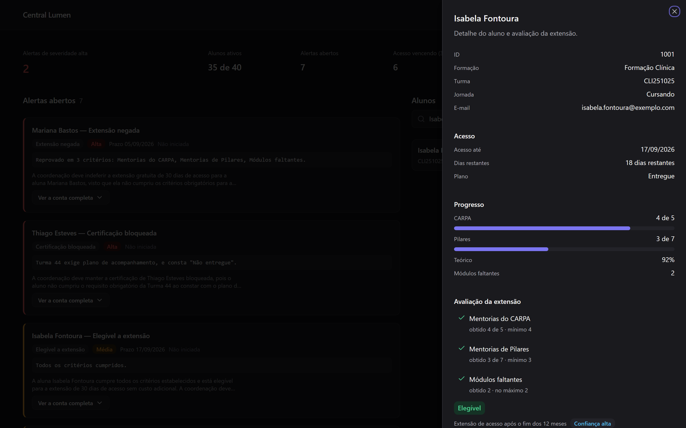
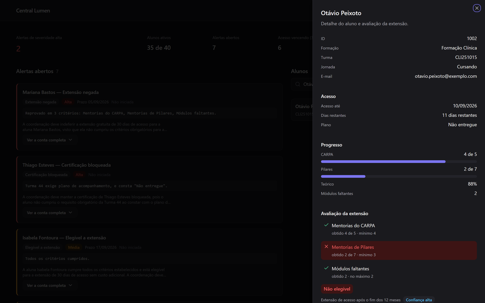
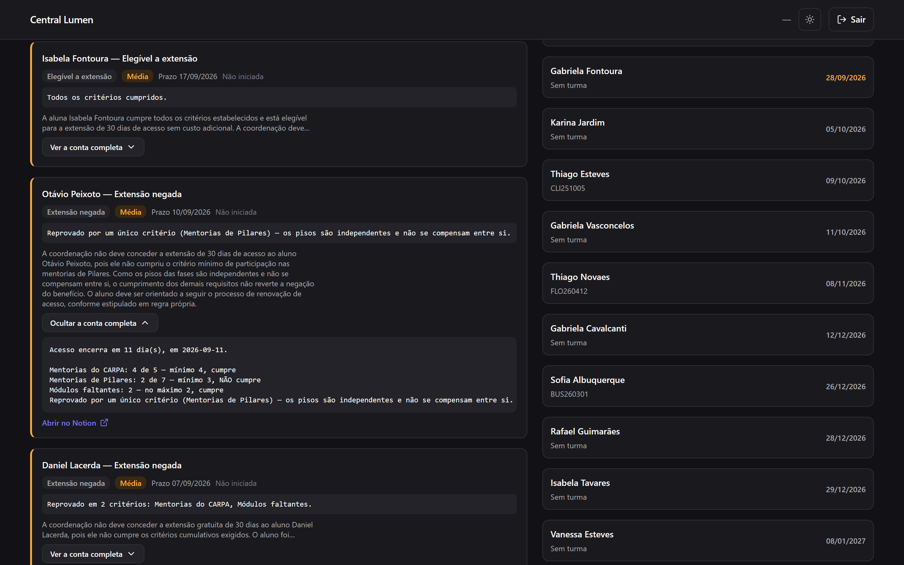
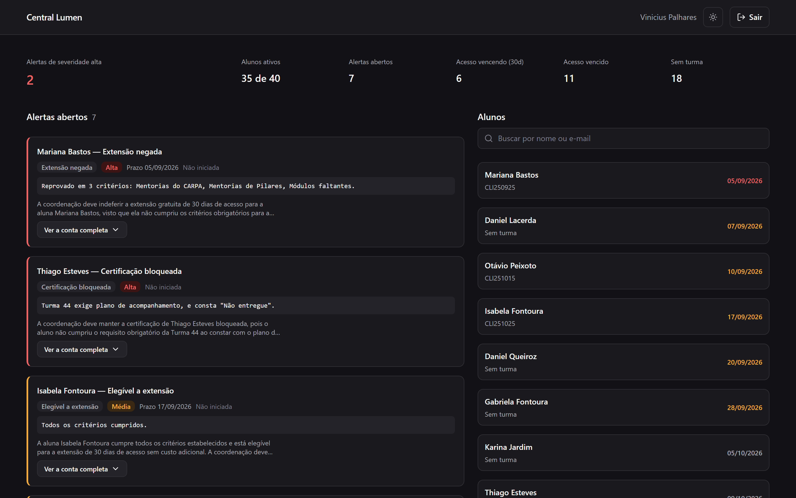
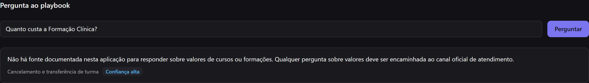
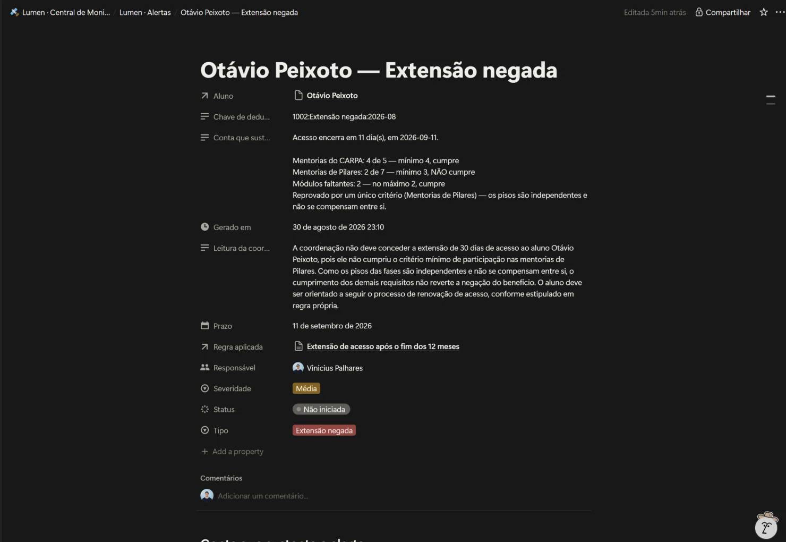

# Central Lumen

Central de monitoramento que integra a **API do Notion** e a **API do Gemini**
para consolidar indicadores operacionais de uma escola, aplicar as regras da
instituição sobre os dados e abrir alertas acionáveis automaticamente.

Trabalho da disciplina de Integração de APIs — UniFECAF.

**Aplicação:** https://lumen-school-pulse.lovable.app — o acesso exige login,
ver [Como acessar](#como-acessar).

> Projeto acadêmico. O **Instituto Lumen** é uma instituição fictícia. Os 40
> perfis de aluno são sintéticos, gerados por script versionado com semente
> fixa. Nenhum dado corresponde a pessoa real.

---

## O problema

Informação operacional de uma escola vive espalhada: cadastro do aluno num
sistema, regras de negócio num documento que alguém escreveu no Notion, e a
decisão de aplicar uma à outra na cabeça de quem atende.

O custo disso não é o tempo de abrir duas abas. É que **a regra e o dado nunca
se encontram sozinhos**. Ninguém varre 1.500 alunos cruzando cada um contra o
playbook toda semana, então o aluno que perdeu o prazo por um critério só
descobre quando o acesso já venceu.

## A solução

Uma varredura automática lê as regras no Notion, lê o cadastro no Notion,
aplica uma sobre o outro, e abre um alerta atribuído a um responsável. Um
painel autenticado consolida tudo numa tela.

O desenho em uma frase: **a regra vem do Notion, a conta é feita em código, e o
modelo só redige.**

| Camada | Responsabilidade | O que ela NÃO faz |
|---|---|---|
| Notion (Playbook) | guarda o texto da regra, com os limiares | não calcula |
| `_shared/regras.mjs` | faz a aritmética e registra a conta literal | não decide o texto da regra |
| Gemini | redige a leitura para a coordenação | **não decide elegibilidade** |
| Notion (Alertas) | registra o caso como trabalho atribuído | não guarda regra |

Essa separação é a decisão de arquitetura do projeto. Se o modelo avaliasse a
elegibilidade, duas execuções sobre o mesmo aluno poderiam divergir e não
haveria como auditar qual estava certa. A decisão é determinística, fica
gravada no campo *Conta que sustenta*, e a leitura gerada aparece ao lado —
qualquer divergência entre as duas é visível na mesma tela.

### O comportamento que define o projeto

A regra documentada diz que o aluno que não terminou em 12 meses pode ganhar
mais 30 dias se participou de pelo menos 60% da formação, **o que na prática
significa no mínimo 4 mentorias do CARPA e 3 de Pilares**, e se faltam no
máximo dois módulos.

A aplicação não consulta uma coluna com a resposta:

| Perfil | CARPA | Pilares | Agregado | Resultado |
|---|---|---|---|---|
| Isabela Fontoura (1001) | 4 de 5 | 3 de 7 | 58% | **concede** |
| Otávio Peixoto (1002) | 4 de 5 | **2** de 7 | 50% | **nega** |

O segundo caso é o que importa. Um sistema que calculasse média diria "você
está em 50%, quase lá". O correto é identificar que a regra define **pisos por
fase**, e que eles não se compensam entre si.

A regra não existe em SQL nem no código. Vive na base Playbook do Notion, e é
aplicada em execução. A coordenação edita o texto lá e o comportamento muda na
chamada seguinte, sem deploy.

---

## APIs utilizadas

### 1. Notion API — `api.notion.com/v1`

Faz dois papéis, e é essa dupla função que justifica a escolha.

**Banco de dados no-code.** Três bases relacionadas: *Alunos* (registro
operacional), *Playbook* (regras) e *Alertas* (saída da automação). A relação
entre elas é nativa da ferramenta, não emulada em código.

**Fila de trabalho atribuída.** O campo *Responsável* é do tipo pessoa, e a
base de Alertas funciona como fila: cada caso tem dono, severidade, prazo e
status.

*Por que esta e não Airtable:* a coordenação já trabalha em Notion. Uma regra
que vive onde a coordenação já escreve é uma regra que ela mantém; uma regra
que vive num banco que ela não abre vira documentação morta em duas semanas.
Esse é o argumento, e ele é verificável: editar o texto da regra no Notion muda
o comportamento da aplicação na chamada seguinte.

> **Sobre notificação.** Uma versão anterior deste README afirmava que atribuir
> o *Responsável* dispara a notificação nativa do Notion. **Isso não se
> confirmou nesta configuração, e a afirmação foi removida.** Duas causas, ambas
> verificadas: o token é um Personal Access Token que age *como o próprio
> usuário*, então atribuir a si mesmo é auto-ação e o Notion nunca notifica
> alguém da própria ação; e a página-raiz é privada, então uma menção a outra
> pessoa também não alcança.
>
> O aviso passou a viver **dentro do painel**, e não no Notion. Ver
> [Novidades desde a última varredura](#novidades-desde-a-última-varredura).

**Autenticação:** token `Bearer` no header, versão da API fixada em
`2022-06-28`.

O token em uso é um **Personal Access Token**, e é importante ser preciso sobre
o que isso significa: ele age com as permissões do usuário que o emitiu, sobre
tudo que esse usuário enxerga no workspace. **Não** é escopo por página
compartilhada. Uma integração interna dedicada, compartilhada apenas com a
página-raiz, daria o escopo estreito — e é o que a promoção a produção exige.
Ver [Segurança e governança](#segurança-e-governança).

### 2. Google Gemini API — `generativelanguage.googleapis.com/v1beta`

Dois usos, ambos de redação, nenhum de decisão:

- **Leitura da coordenação** no alerta: transforma a conta já resolvida em duas
  a quatro frases acionáveis. O prompt entrega o resultado pronto e proíbe
  recalcular.
- **Pergunta ao Playbook** no painel: responde dúvida em linguagem natural
  usando só as regras carregadas, e devolve qual regra citou.

*Por que sem busca vetorial:* o Playbook tem cinco regras e cabe inteiro no
prompt. Recuperação por embeddings nessa escala só adiciona um passo que pode
errar. Se o Playbook crescer além da janela de contexto, aí a recuperação passa
a valer o custo.

**Autenticação:** chave de API no header `x-goog-api-key`, guardada como
segredo da Edge Function e nunca exposta ao navegador.

### Supabase — infraestrutura, não integração

Entra por dois motivos e só por eles: **autenticação** (e-mail e senha, JWT) e
**trilha de auditoria**. Não guarda dado de aluno — duplicar o registro criaria
duas fontes da verdade que divergem na primeira edição.

---

## Fluxo de integração

```
                        ┌──────────────────────────┐
   coordenação  ─edita─▶│  Notion · Playbook       │
                        │  (regras em texto)       │
                        └────────────┬─────────────┘
                                     │ lê a regra
                                     ▼
  ┌────────────────┐         ┌───────────────────┐        ┌─────────────┐
  │ Notion · Alunos│──lê────▶│  varredura.mjs    │──pede─▶│   Gemini    │
  │  (cadastro)    │         │  aplica a regra   │◀─texto─│  (redação)  │
  └────────────────┘         └─────────┬─────────┘        └─────────────┘
                                       │ grava
                                       ▼
                             ┌───────────────────┐
                             │ Notion · Alertas  │──atribui──▶ responsável
                             └───────────────────┘
```

O painel percorre o mesmo grafo por leitura:

```
  navegador ──JWT──▶ Edge Function `painel` ──token──▶ Notion (3 bases)
                              │                └──chave──▶ Gemini
                              └──registra──▶ Supabase `acessos`
```

O navegador **nunca** fala com o Notion nem com o Gemini. As duas credenciais
vivem só na Edge Function. Um front-end que chamasse a API do Notion direto
precisaria embarcar o token no bundle, e bundle é público por definição.

### A automação

`scripts/varredura.mjs`. Roda por `npm run varredura` ou pelo disparo manual do
workflow em GitHub Actions.

**O agendamento está desligado, e a ausência é decisão registrada.** Ligar o
`schedule` exigiria guardar o `NOTION_TOKEN` nos segredos deste repositório, que
é público. Esse token é um Personal Access Token e carrega o acesso do emissor
ao workspace inteiro, não só às três bases — a limitação está detalhada em
[Segurança e governança](#segurança-e-governança). Guardar uma credencial de
alcance largo em mais um lugar, para ganhar um cron num projeto acadêmico, é uma
troca ruim. O gatilho está versionado e comentado no workflow, pronto para ser
religado quando o PAT for trocado por uma integração escopada.

Por aluno, avalia três situações:

| Situação | Condição | Severidade |
|---|---|---|
| Acesso vencendo / extensão | acesso encerra em até 30 dias | Alta se ≤ 7 dias |
| Certificação bloqueada | teórico em 100%, turma ≥ 41, plano não entregue | Alta |
| Desengajamento | turma ativa, teórico < 40% | Baixa |

Deduplicação por `alunoId : tipo : ciclo mensal`. Sem isso, uma varredura
diária reabriria o mesmo alerta todo dia e a coordenação pararia de olhar a
base.

Jornadas encerradas (Churn, Abandonou, Reembolsado) são puladas. Cobrar plano
de acompanhamento de quem pediu reembolso é o tipo de ruído que faz um painel
inteiro ser ignorado.

### Novidades desde a última varredura

O painel marca quais alertas saíram da varredura mais recente: uma contagem no
título da seção e um chip nos cards.

**O que isto é, dito com precisão:** o painel informa o que mudou **quando você
o abre**. Não é notificação por envio. Ninguém é alcançado enquanto está fora do
sistema — a varredura roda de manhã, e a coordenação descobre ao abrir o painel.
Chamar isso de "notificação" sem a ressalva seria o mesmo erro que este README
já cometeu uma vez.

Duas decisões que valem registro:

**A referência é a varredura, não a visita.** Marcar "o que você ainda não viu"
usaria a trilha de auditoria, que já registra cada consulta. Foi descartado
porque degenera: abrir o painel duas vezes seguidas zeraria a marcação na
segunda, e num painel operacional isso lê como defeito. Por varredura, a
marcação é estável até a próxima execução.

**Quando tudo é novo, nada é marcado.** Se todos os alertas abertos vieram da
mesma varredura, o servidor devolve `destacarNovos: false` mesmo com
`novos > 0`. Sete marcadores idênticos numa lista de sete não distinguem nada —
só repetem a contagem total com outra palavra. Nesse caso a interface mostra a
data da varredura, que informa, e omite a marcação, que não informa.

A regra vive no servidor, e não na interface, porque a pergunta *"isto distingue
alguma coisa?"* é semântica e se responde onde os dados estão.

Os dois ramos estão verificados na interface publicada. O positivo não é
alcançável com os dados atuais — enquanto todos os alertas vierem da mesma
varredura, a API responde `destacarNovos: false` e o chip nunca aparece — então
`npm run verificar:novos` intercepta a resposta no navegador e força o caso.
Nada é gravado: a alteração vive só na memória da página.

---

## Segurança e governança

**Autenticação separada de autorização.** Existir em `auth.users` prova
identidade, não permissão. A liberação passa pela tabela `perfis`, com padrão
`false`, escrita só pelo service role. Usuário autenticado e não liberado
recebe 403 com tela própria — nunca um laço de redirecionamento para o login.

**Credenciais em uma camada só.** Token do Notion e chave do Gemini vivem
apenas como segredo da Edge Function.

**Trilha de auditoria.** Toda consulta grava em `acessos` quem consultou, qual
ação e qual identificador. Não grava o conteúdo devolvido: duplicaria o dado no
log e alargaria a superfície que a minimização tenta reduzir. A tabela não tem
política de leitura — quem é auditado não lê a própria trilha.

**Fronteira de dados explícita.** As três bases vivem sob uma única página-raiz
no Notion, e a integração é compartilhada só com ela. **Escopo de integração no
Notion falha aberto:** compartilhar uma página nova com a mesma integração
amplia o alcance do token sem aviso. A fronteira só se sustenta enquanto for
decisão consciente de quem compartilha, e por isso está escrita na própria
página-raiz.

**Minimização por desenho.** O esquema carrega só campos que respondem alguma
pergunta do escopo. Documento de identificação, telefone e endereço ficaram de
fora — nem sintéticos, porque nenhuma resposta depende deles.

**O modelo não decide.** Detalhado acima. O campo *Conta que sustenta* é
computado, e o alerta carrega um aviso dizendo que, havendo divergência entre a
conta e a leitura gerada, a conta prevalece.

---

## Prints

### O par que define o projeto

A mesma pergunta, dois alunos, resultados opostos — e o motivo visível na tela.

**Isabela Fontoura (1001): 4 de 5 no CARPA, 3 de 7 em Pilares.**



**Otávio Peixoto (1002): os mesmos 4 de 5 no CARPA, e 2 de 7 em Pilares.**



Somando as duas fases, Otávio tem 6 de 12 — cinquenta por cento. Um sistema que
calculasse média diria "quase lá". A Central nega, e a tela mostra por quê: só
*Mentorias de Pilares* está em vermelho, com `obtido 2 de 7 · mínimo 3`.

Repare que são **duas barras separadas**. Não é escolha estética: uma barra
única de "participação" mostraria 50% e esconderia exatamente a informação que
decide o caso.

### A conta que sustenta o alerta



No card fechado, o veredito monoespaçado responde "por quê" sem clique. Aberto,
mostra a conta inteira — computada em código — logo abaixo da leitura redigida
pelo modelo. As duas lado a lado, e o alerta declara que a conta prevalece.

### O painel



*Alertas de severidade alta* é o único indicador em destaque, porque é o único
acionável. Os alertas vêm ordenados por severidade, e a ordem da API é
preservada.

### O guardrail



Preço não está documentado em nenhuma fonte que a aplicação consulta. Ela
recusa em vez de estimar, e mostra de onde tirou a recusa.

### Os demais

| Print | O que mostra |
|---|---|
| [01-login.png](docs/prints/01-login.png) | card de login centrado, sem cadastro aberto |
| [08-mobile-375.png](docs/prints/08-mobile-375.png) | 375px, sem rolagem horizontal |
| [09-perfil-bloqueado.png](docs/prints/09-perfil-bloqueado.png) | o 403: credencial válida, acesso não liberado, com saída explícita |

### O registro no banco no-code



Um alerta como a automação o deixa. **O que este print prova**, e vale ser
preciso: que a varredura escreve um registro *estruturado e relacionado* num
banco no-code — `Aluno` e `Regra aplicada` são relações de volta, não texto
copiado; a `Conta que sustenta` é a aritmética determinística; a `Chave de
deduplicação` é o que impede o mesmo caso de reabrir amanhã. É o requisito de
persistência e o de automação, visíveis ao mesmo tempo.

**O que ele não prova:** que alguém foi avisado. `Responsável` está preenchido,
mas o Notion não dispara notificação nesta configuração — a causa está em
[Segurança e governança](#segurança-e-governança), e o aviso vive no painel.

### Como regerar

```bash
npm run prints
```

O script obtém a sessão por magic link gerado pela Admin API e a injeta no
navegador. **Nenhuma senha é digitada, lida ou guardada** — um script de
captura não precisa da credencial de ninguém.

Cada captura espera por um estado nomeado antes de disparar. A primeira versão
esperava pelo texto "Avaliação da extensão" e capturou a tela em
"Carregando…": a descrição do painel contém essa frase e já existe no
esqueleto, então a espera resolvia na hora. Agora espera pelo título virar o
nome do aluno.

## Como acessar

**Aplicação:** https://lumen-school-pulse.lovable.app

O painel exige login, e **não há cadastro aberto**. Isso é decisão de desenho,
não obstáculo: autenticação e autorização são camadas separadas, e uma conta
recém-criada nasce com `liberado = false` e recebe `403` até que a coordenação a
libere. Ver [Segurança e governança](#segurança-e-governança).

Para avaliação existe uma conta de leitura já liberada. **A credencial vai junto
da entrega, não neste arquivo** — um repositório público é lido por muita gente
que não precisa entrar, e o avaliador procura a credencial onde entregou o
trabalho, não no README.

### O que essa conta alcança, medido

Não é promessa, é teste. Com um JWT válido dessa conta, indo **direto ao
PostgREST** para contornar a Edge Function:

| Alvo | Resposta |
|---|---|
| `painel` — resumo, alunos, aluno, alertas, perguntar | `200` — é o objetivo |
| `acessos` (trilha de auditoria) | `200 []` — RLS sem política: zero linhas |
| `perfis` | `200` — só a própria linha |
| `alunos`, `chunks`, `fontes`, `mensagens`, `conversas`, `testes_guardrail`, `anonimizacao` | `403` |
| `PATCH perfis` (tentar se auto-liberar) | `400` |

As sete tabelas em `403` são de **outro projeto** que compartilha o mesmo
Supabase. Era o risco real de reaproveitar a infraestrutura, e ele não se
concretiza: o papel `authenticated` não tem privilégio sobre elas.

O que a conta pode fazer de indesejado é consumir cota do Gemini pelo campo de
pergunta. É custo, não vazamento, e some quando a avaliação termina:

```sql
update perfis set liberado = false where nome = 'Avaliação';
```

### O que este repositório expõe, e o que não

Público por desenho: a chave publicável do Supabase — que vive no bundle do
navegador de qualquer jeito —, o identificador do projeto e os IDs das três
bases do Notion. **Conhecer o ID de uma base não dá acesso a ela**; o acesso vem
do token.

**O token do Notion e a chave do Gemini nunca chegam ao navegador.** Vivem
apenas como segredo da Edge Function, e é essa a razão de a função existir. Nem
o estado atual nem o histórico do repositório contêm qualquer segredo — o
histórico importa tanto quanto o estado, porque um `.env` commitado e removido
depois continua lá.

## Como executar

```bash
npm install          # sem dependências de runtime; só valida o Node 20+
cp .env.example .env # preencher NOTION_TOKEN, GEMINI_API_KEY, ...
```

| Comando | O que faz |
|---|---|
| `npm run testar` | 21 testes: motor de regras e marcação de novos. Sem rede. |
| `npm run semear-playbook` | carrega `regras/*.md` na base Playbook |
| `npm run gerar-alunos` | gera os 40 perfis sintéticos e carrega no Notion |
| `npm run seed` | os dois acima, na ordem |
| `npm run varredura:secar` | roda a avaliação e imprime, **sem** gravar e sem chamar o Gemini |
| `npm run varredura` | a automação completa |
| `npm run prints` | regera as capturas de `docs/prints/`, sem usar senha |
| `npm run pdf` | regera `docs/DOCUMENTO_TEORICO.pdf` a partir do markdown |
| `npm run verificar:novos` | confere os dois ramos da marcação de novos na interface publicada |
| `npm run testar:consultas` | camada de dados do painel contra o Notion real |
| `npm run testar:tudo` | as duas baterias, incluindo as rotas do Gemini |

`--secar` existe em ambos os scripts de carga porque a alternativa é descobrir
um erro de mapeamento depois de gravar 40 páginas no Notion.

### Preparar o Notion

1. Criar uma **integração interna** em notion.so/my-integrations — não um
   Personal Access Token. A diferença importa: o PAT herda todo o acesso do
   usuário que o emitiu, enquanto a integração só alcança o que for
   explicitamente compartilhado com ela.
2. Compartilhar **apenas** a página *Lumen · Central de Monitoramento* com ela.
3. Copiar o token para `NOTION_TOKEN`.
4. Pôr em `NOTION_RESPONSAVEL_ID` o ID do usuário que deve receber os alertas.
   Sem ele os alertas são criados sem dono.

Os IDs das três bases estão versionados em `scripts/config.mjs`. Conhecer o ID
não dá acesso; o acesso vem do token.

### Deploy da Edge Function

```bash
npx supabase functions deploy painel --project-ref <seu-project-ref> --no-verify-jwt
```

`--no-verify-jwt` é obrigatório, e não é afrouxamento. A validação do JWT
acontece **dentro** da função, porque o `verify_jwt` da plataforma devolve 401
genérico e não distingue "credencial inválida" de "perfil não liberado". Sem a
distinção, o cliente manda o usuário não liberado para a tela de login num laço
que nunca resolve.

Os segredos `NOTION_TOKEN`, `GEMINI_API_KEY` e `GEMINI_MODEL` são configurados
no painel do Supabase, em Edge Functions. Faltando um deles, a função responde
`500` **nomeando a variável ausente** — o único caso em que ela abre mão da
mensagem genérica de erro, porque um 500 mudo deixa quem fez o deploy sem pista.

### Liberar um usuário

Cadastro não é aberto. Ao criar o usuário no painel de Authentication, o gatilho
já insere a linha em `perfis` com `liberado = false`. Autorizar é um ato
deliberado e separado:

```sql
update perfis set nome = 'Nome da Pessoa', liberado = true
 where id = '<uuid do usuário>';
```

### Agendamento

`.github/workflows/varredura.yml`. Exige os segredos `NOTION_TOKEN`,
`NOTION_RESPONSAVEL_ID` e `GEMINI_API_KEY` no repositório.

---

## Estrutura

```
regras/                     as regras em markdown — estado inicial auditável
scripts/
  config.mjs                IDs das bases e carregamento de .env
  gerar_alunos.mjs          40 perfis sintéticos -> Notion
  semear_playbook.mjs       regras/*.md -> Notion
  varredura.mjs             A AUTOMAÇÃO
  regras.test.mjs           16 testes do motor de regras
  alertas.test.mjs          5 testes da marcação de novos
  testar_consultas.mjs      fumaça contra o Notion real
supabase/
  functions/
    _shared/notion.mjs      cliente REST, compartilhado Node e Deno
    _shared/regras.mjs      o motor de regras
    _shared/consultas.mjs   camada de dados do painel
    painel/index.ts         autenticação, roteamento e auditoria
  migrations/               perfis, auditoria, gatilho de perfil
Code/                       o front-end, exportado do Lovable
  DESIGN.md                 o design system, derivado do código
  .impeccable/design.json   rampas tonais e componentes do design system
  src/routes/               login e painel
  src/components/           os componentes próprios
  src/styles.css            os tokens: 21 cores por tema, dois temas
docs/
  TOKENS.css                tema em variáveis CSS, o ponto de partida
  PROMPT_LOVABLE.md         especificação original da interface
  PROMPT_REVISAO_INTERFACE.md  as correções de interface, com a justificativa
  prompt-lovable.txt        extrato do anterior, pronto para colar
  DOCUMENTO_TEORICO.md      documento da disciplina
  DOCUMENTO_TEORICO.pdf     o mesmo, em PDF, gerado por npm run pdf
  ROTEIRO_VIDEO.md          roteiro do pitch de 4 minutos
```

Duas fontes de verdade convivem no repositório, e a distinção importa:
`docs/PROMPT_LOVABLE.md` é a **especificação** da interface, escrita antes de
existir código; `Code/DESIGN.md` é o **sistema que de fato foi construído**,
derivado do código depois. Quando os dois divergirem, o DESIGN.md está certo —
ele descreve, a especificação prescrevia.

`_shared/` guarda o que roda nos dois runtimes. O cliente do Notion foi escrito
à mão em vez de usar `@notionhq/client` justamente por isso: a mesma conversão
de propriedades precisa valer em Node e em Deno, e uma dependência a menos é um
caminho a menos para os dois divergirem.

---

## Origem

A infraestrutura deste projeto deriva do **Lumen**, copiloto de dúvidas do aluno
entregue na disciplina de IA Generativa Aplicada ao Desenvolvimento. Foram
reaproveitados o universo fictício, o gerador de perfis sintéticos e a
disciplina de governança.

O produto é outro. O Lumen respondia perguntas sob demanda; a Central varre a
base sem ninguém pedir, aplica a regra e abre trabalho. A regra migrou de
arquivo markdown fora do repositório para uma base no Notion que a coordenação
edita, e a persistência migrou de Postgres com `pgvector` para o banco no-code.
